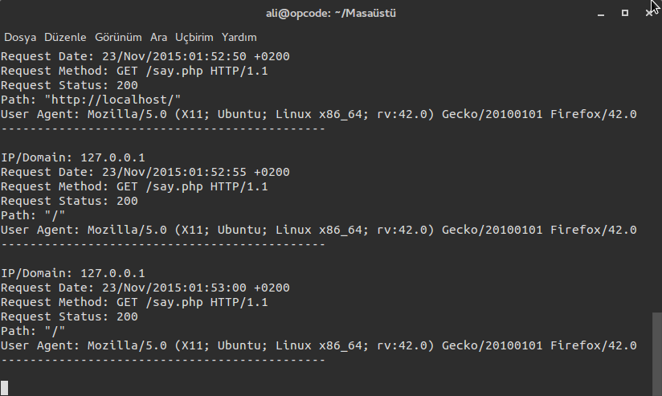

#Apache2 HTTP Request Handler

**nginx için apache2 olan kısmı nginx olarak düzeltebilirsiniz**

---

***Şu An İçin Sadece Debian Tabanlı Sistemlerde***

Apache2 HTTP isteklerini yakalayıp daha insani hale getirir. Örnek bazı çıktılar:

**Root Dizini İçin**


**Root Dizininde Otomatik Yenilenen Dosya İçin**



**Alt Dizinler İçin**


Python3 ile çalışır. Zaten çok basit olduğu için alıp kendinize göre özelleştirebilirsiniz.

**Bazı Çıktılar:**

```shell
IP/Domain: 127.0.0.1
Request Date: 23/Nov/2015:02:01:32 +0200
Request Method: GET /sinav/ HTTP/1.1         
Request Status: 200
Path: "http://localhost/"
User Agent: Mozilla/5.0 (X11; Ubuntu; Linux x86_64; rv:42.0) Gecko/20100101 Firefox/42.0
---------------------------------------------

IP/Domain: 127.0.0.1
Request Date: 23/Nov/2015:02:01:32 +0200
Request Method: GET /sinav/daire_alani_form.php HTTP/1.1         
Request Status: 200
Path: "http://localhost/sinav/"
User Agent: Mozilla/5.0 (X11; Ubuntu; Linux x86_64; rv:42.0) Gecko/20100101 Firefox/42.0
---------------------------------------------

IP/Domain: 127.0.0.1
Request Date: 23/Nov/2015:02:01:37 +0200
Request Method: POST /sinav/daire_alani.php HTTP/1.1         
Request Status: 200
Path: "http://localhost/sinav/daire_alani_form.php"
User Agent: Mozilla/5.0 (X11; Ubuntu; Linux x86_64; rv:42.0) Gecko/20100101 Firefox/42.0
```
